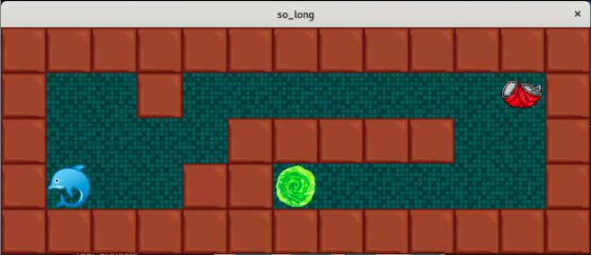

<h1 align="center">so_long</h1>
<h3 align="center">A little maze and collect made from scratch in C with the minilibX</h3>

 - Little preview

 So long and thanks for the fish

<h6>  Installation :</h6>

make

./so_long maps/[map.ber]
<h6>  Controls :</h6>

   - ESCAPE to enter live mode

   - WASD to move the dolphin

- 🌱 Made at 42

